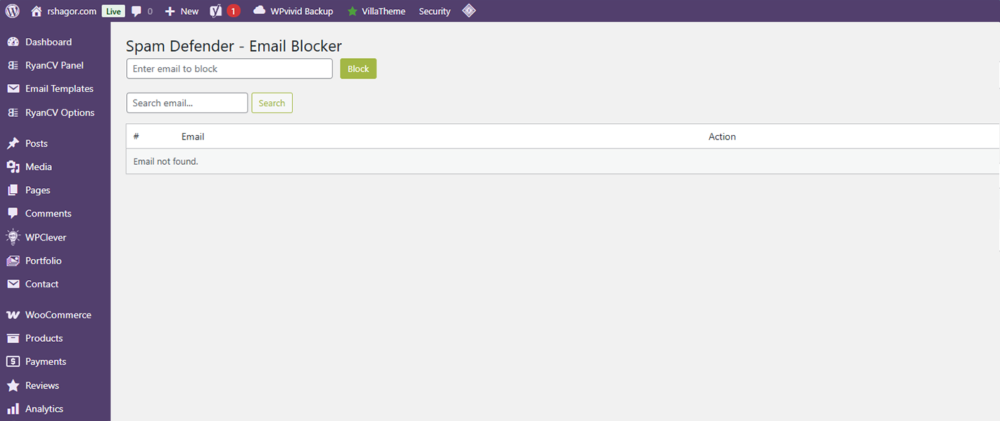
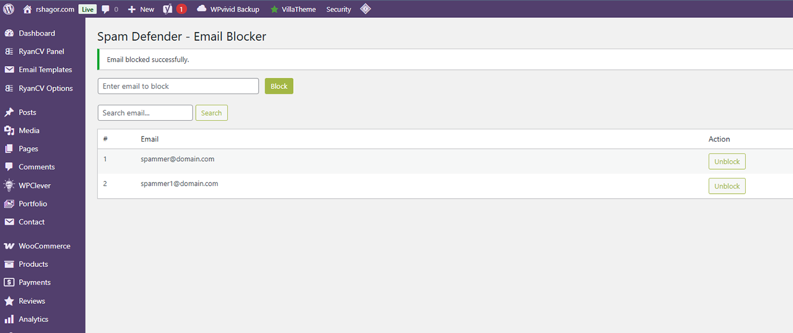
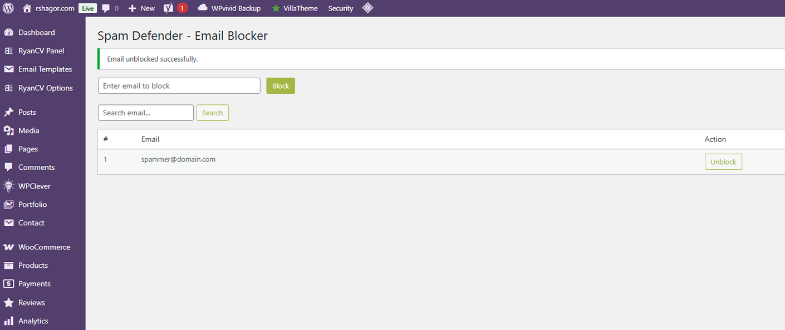
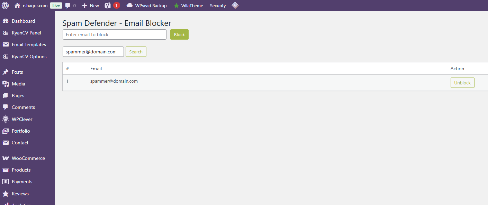

# 🚫 Spam Defender - Email Blocker

---
Block specific email addresses from using your WordPress site. Stop fake orders, spam registrations, and unwanted comments with this lightweight and secure plugin.
---

## 📌 Plugin Information
- **Contributors:** shagor447  
- **Tags:** email, block, registration, comments, woocommerce  
- **Requires at least:** WordPress 4.8  
- **Tested up to:** WordPress 6.8  
- **Requires PHP:** 7.0 
- **Stable tag:** 1.0.2 
- **License:** [GPLv2 or later](https://www.gnu.org/licenses/gpl-2.0.html)  

---

## 📖 Description
**Spam Defender - Email Blocker** helps you reduce spam and fake activity by blocking specific email addresses or domains.  
Once blocked, users with those emails will not be able to:  

- Register new accounts  
- Login  
- Post comments  
- Checkout or create accounts in **WooCommerce**  

This plugin is lightweight, easy to use, and comes with an admin settings page where you can manage blocked emails/domains.

---

## ✨ Features
- Block emails globally across WordPress  
- Block on **login, registration, comments, and WooCommerce checkout**  
- Manage blocked emails from the settings page  
- Search blocked email lists  
- Prevents fake orders and spam signups  

---

## ⚙️ Installation
1. Upload the `spam-defender-email-blocker` directory to the `/wp-content/plugins/` directory.
2. Alternatively, download the repository as a ZIP file, then go to Dashboard > Plugins > Add Plugin > Upload Plugin > install Now > and Activate Plugin.
3. Activate the plugin through the **Plugins** menu in WordPress.  
4. Navigate to **Dashboard > Settings > Block Email** and configure your blocked emails/domains.  

---

## ❓ Frequently Asked Questions

### 🔹 Will this block existing users with blocked emails?
No. It prevents **future registrations, logins, comments, and checkouts** using blocked emails.  

### 🔹 Does it work with WooCommerce?
Yes ✅ WooCommerce checkout and account creation are fully supported.  

### 🔹 Is my data secure?
Yes ✅ all email data is securely handled.  

---

## 🖼️ Screenshots
1. Admin settings page to manage blocked emails.    
2. Blocked email options. 
3. Unblocked email options. 
4. Search functionality. 

---

## 📝 Changelog

### 1.0.0
- Initial release.
- Block email addresses from registration, login, comments, and WooCommerce checkout.

### 1.0.1 
- Added **Settings link** on the plugin page  
- Improved settings form design (inline input + button)  
- Added serial numbers in blocked email list  
- Added **search box with form submit**  
- Added **pagination (20 per page)**

### 1.0.2
- Added nonce **verification** for admin actions (block / unblock email). 
- Inserted **nonce fields** in admin forms to protect against CSRF. 
- Used `wp_unslash()` before sanitizing input from `$_POST` and `$_GET`.
- Escaped output properly using `esc_html()`, `wp_kses_post()`, and `esc_html__()`.
- Sanitized checkout email field **(billing_email)** with **wp_unslash()** + **sanitize_email()**.
- Added `// phpcs:ignore` to prevent false-positive warnings for nonce checks (WooCommerce handles its own security).

---

## 📢 Update Notice
Recommended update — introduces better UI and management features (search, pagination, settings link).

## ⚖️ License & Copyright
- Copyright © **Raisul Islam Shagor** 
- Contact: deploy@raisul.dev
- Website: https://raisul.dev/
- Licensed under the **GPLv2 or later**  
- ✅ This plugin is **free to use, modify, and distribute** under the license terms.
